# Task 2: Deployment and Configuration

This guide documents how Secrets, ConfigMaps, health probes, and deployment strategies were configured in Kubernetes for the microservices and databases.  

---

**Source code:** [https://git.epam.com/yevhen_palamarchuk/kubernetes-for-devs/-/tree/main/tasks/02/src](https://git.epam.com/yevhen_palamarchuk/kubernetes-for-devs/-/tree/main/tasks/02/src)

**K8s manifests:** `k8s-manifests/`

---

## Sub-task 1: Secrets and ConfigMaps

### Requirements

- Add **Secrets** to store DB username and password.
- Add **ConfigMaps** to store environment variables for application deployments.
- Add **SQL scripts** to init databases (create tables) to ConfigMaps.
- Update **Deployment** and **StatefulSet** objects to load these Secrets and ConfigMaps.

### Implementation summary

- Secrets:
    - `resources-db-credentials` (POSTGRES_USER / POSTGRES_PASSWORD)
    - `songs-db-credentials` (POSTGRES_USER / POSTGRES_PASSWORD)
- App ConfigMaps:
    - `app-common` – shared JVM/JPA props
    - `resources-config` – resources MS name, port, datasource URL
    - `songs-config` – songs MS name, port, datasource URL
- DB ConfigMaps:
    - `resources-db-config` → `POSTGRES_DB=resources`
    - `resources-db-init-sql` → `01_resources.sql` creates table `resources`
    - `songs-db-config` → `POSTGRES_DB=songs`
    - `songs-db-init-sql` → `01_songs.sql` creates table `songs` including `genre`
- StatefulSets:
    - `resources-db` and `songs-db` load:
        - `POSTGRES_DB` from `*-db-config` ConfigMap
        - `POSTGRES_USER` / `POSTGRES_PASSWORD` from `*-db-credentials` Secret
        - SQL scripts mounted from `*-db-init-sql` ConfigMaps to `/docker-entrypoint-initdb.d`
- Deployments:
    - `resources` and `songs` load DB credentials from Secrets via `SPRING_DATASOURCE_USERNAME`/`SPRING_DATASOURCE_PASSWORD`
    - Additional env from `app-common` and service-specific ConfigMaps via `envFrom`.

### Verification steps

```bash
kubectl get configmaps -n k8s-program
```
📸 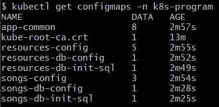

```bash
kubectl get secrets -n k8s-program
```
📸 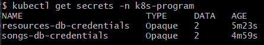

```bash
kubectl describe secret resources-db-credentials -n k8s-program
```
📸 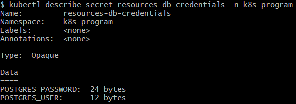

```bash
kubectl describe secret songs-db-credentials -n k8s-program
```
📸 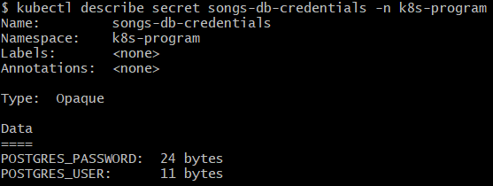

```bash
kubectl describe statefulset resources-db -n k8s-program | egrep -A8 "Env|Volume Mounts"
```
📸 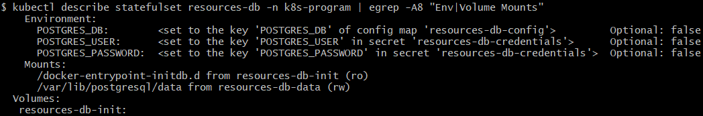

```bash
kubectl describe statefulset songs-db -n k8s-program | egrep -A8 "Env|Volume Mounts"
```
📸 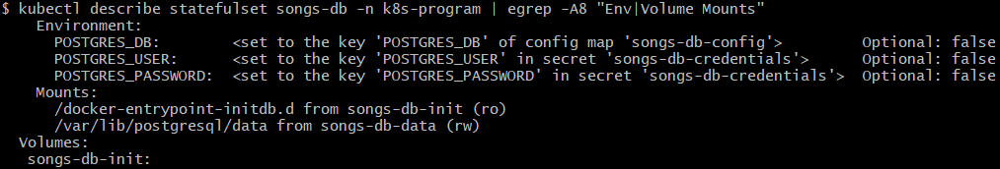

```bash
kubectl describe deploy resources -n k8s-program | egrep -A8 "Env|EnvFrom"
```
📸 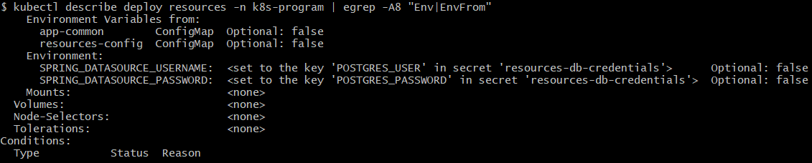

```bash
kubectl describe deploy songs -n k8s-program | egrep -A8 "Env|EnvFrom"
```
📸 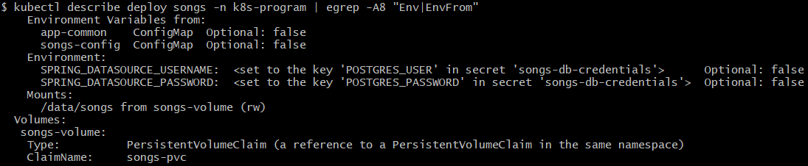

```bash
MSYS_NO_PATHCONV=1 kubectl exec -n k8s-program resources-db-0 -- ls /docker-entrypoint-initdb.d
```
📸 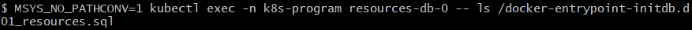

```bash
MSYS_NO_PATHCONV=1 kubectl exec -n k8s-program songs-db-0 -- ls /docker-entrypoint-initdb.d
```
📸 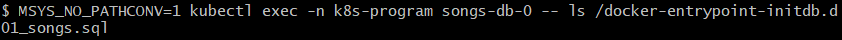

```bash
kubectl exec -it -n k8s-program resources-db-0 --   psql -U "$POSTGRES_USER" -d "$POSTGRES_DB" -c '\dt'
```
📸 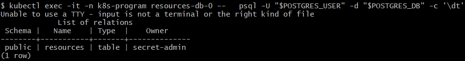

```bash
kubectl exec -it -n k8s-program songs-db-0 --   psql -U "$POSTGRES_USER" -d "$POSTGRES_DB" -c '\dt'
```
📸 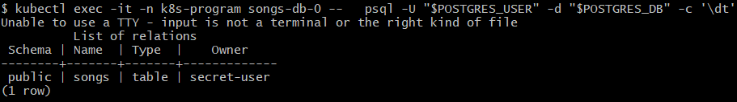

---

## Sub-task 2: Liveness and Readiness Probes

### Requirements

- Add endpoints for health checks in applications.
- Add **startup**, **liveness**, and **readiness** probes to **Deployment** objects.
- Add **startup**, **liveness**, and **readiness** probes to **StatefulSet** objects.

### Implementation summary

- Java code:
    - Spring Boot Actuator health endpoints enabled (`/actuator/health`, `/actuator/health/liveness`, `/actuator/health/readiness`).
- Deployments:
    - `resources` Deployment (port 8080) and `songs` Deployment (port 8081) both configured with:
        - `startupProbe` → `GET /actuator/health`
        - `livenessProbe` → `GET /actuator/health/liveness`
        - `readinessProbe` → `GET /actuator/health/readiness`
- StatefulSets:
    - `resources-db` and `songs-db`:
        - `startupProbe` → `pg_isready` exec
        - `livenessProbe` → TCP socket check on port 5432
        - `readinessProbe` → `pg_isready` exec

### Verification steps

```bash
kubectl describe deploy resources -n k8s-program | egrep -A15 "Liveness|Readiness|Startup"
```
📸 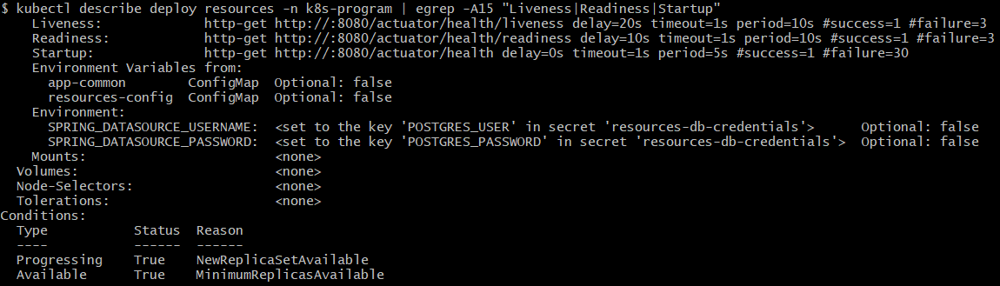

```bash
kubectl describe deploy songs -n k8s-program | egrep -A15 "Liveness|Readiness|Startup"
```
📸 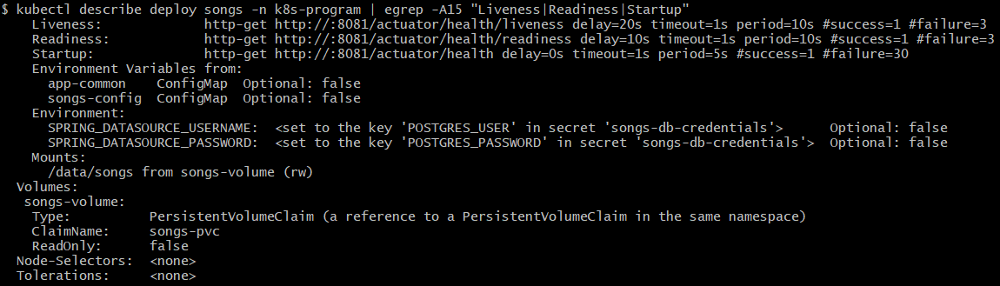

```bash
kubectl describe statefulset resources-db -n k8s-program | egrep -A15 "Liveness|Readiness|Startup"
```
📸 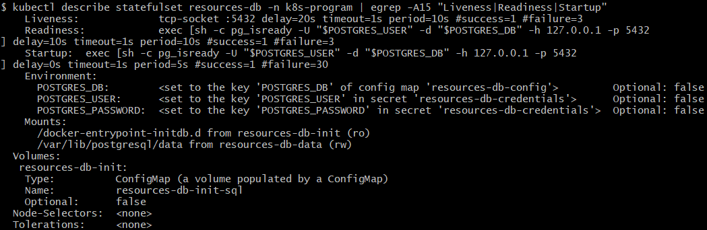

```bash
kubectl describe statefulset songs-db -n k8s-program | egrep -A15 "Liveness|Readiness|Startup"
```
📸 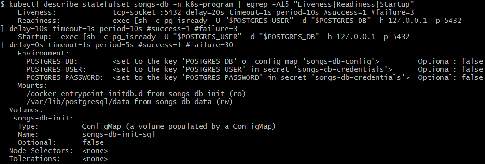

```bash
kubectl get pods -n k8s-program
```
📸 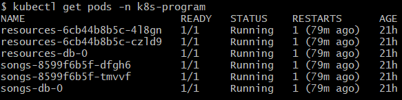

```bash
curl -s http://localhost:30080/actuator/health | jq
```
📸 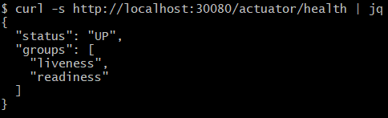

```bash
curl -s http://localhost:30081/actuator/health | jq
```
📸 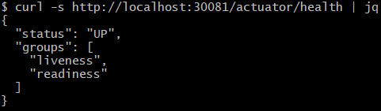

---

## Sub-task 3: Deployment Strategies (Rolling Update & New Field)

### Requirements

- Add new field `genre : String` to **Song** service.
- Make sure `genre` is stored in DB and returned in POST/GET responses.
- Build a new Docker image with changes and push it to Docker Hub (new version tag).
- Add **RollingUpdate** strategy to Deployments.
- Set container image to the new version and apply manifests so old pods are replaced by new ones using rolling update.

### Implementation summary

- **Domain & DB:**
    - `SongData` entity updated with field:
      ```java
      @Column
      String genre;
      ```
    - `songs` table created via `01_songs.sql` includes:
      ```sql
      genre TEXT
      ```
    - Controller/DTO updated so `genre` is handled and returned in POST/GET.
- **DTO & API layer:**
    - `SongDto` updated with field:
      ```java 
          String genre;
      ```
    - Mapping between `SongData` and `SongDto` updated so `genre` is:
        - accepted in **POST /songs** requests
        - returned in **GET /songs** responses.
- **Docker image:**
    - New image built locally only and tagged as songs-service:1.1 for testing inside the local environment.
- **RollingUpdate strategy:**
    - Both Deployments include:
      ```yaml
      strategy:
        type: RollingUpdate
        rollingUpdate:
          maxUnavailable: 1
          maxSurge: 0
      ```
- **New image version in Deployment:**
    - `deploy-songs.yaml` uses:
      ```yaml
      image: songs-service:1.1
      ```

### Verification steps

```bash
kubectl describe deploy songs -n k8s-program | grep -A5 "Strategy"
```
📸 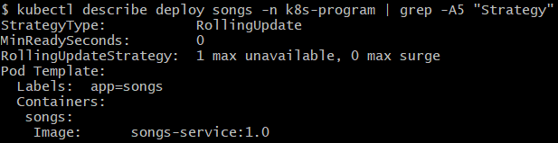

```bash
kubectl describe deploy resources -n k8s-program | grep -A5 "Strategy"
```
📸 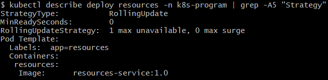

```bash
kubectl apply -f k8s-manifests/songs/deploy-songs.yaml -n k8s-program
```
📸 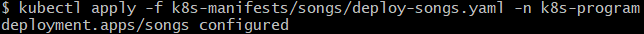

```bash
kubectl rollout status deploy/songs -n k8s-program
```
📸 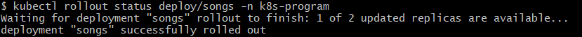

```bash
kubectl get pods -n k8s-program
```
📸 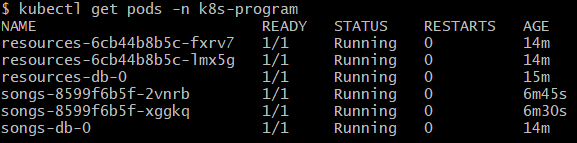

```bash
kubectl get rs -n k8s-program
```
📸 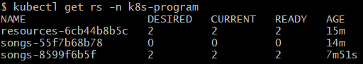

```bash
kubectl describe pod <one-songs-pod> -n k8s-program | grep -i "Image:"
```
📸 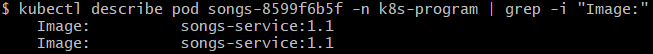

```bash
curl -s --location \
  'http://localhost:30081/songs' \
  --header 'Content-Type: application/json' \
  --data '{
    "name": "Test Song",
    "artist": "Test Artist",
    "album": "Test Album",
    "genre": "Rock",
    "length": "03:30",
    "resourceId": 1,
    "year": "2024"
  }' | jq

```
📸 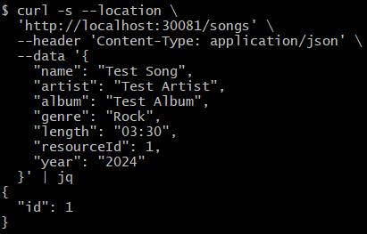

```bash
curl -s --location 'http://localhost:30081/songs/1' | jq
```
📸 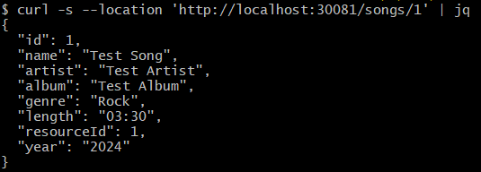

---

## Sub-task 4: Deployment History & Rollback

### Requirements

- View the history of deployments.
- Roll back to previous version **without changing manifest files**.
- Put the solution (commands) in comments in the report.

### Implementation summary

- The `songs` Deployment was updated multiple times, creating multiple revisions:
    - Revisions 1, 2, then 3 after rollback.
- Rollback was done purely with `kubectl`, with no manifest edits.

### Commands (to put in comments as required)

```text
# Show deployment history for songs service
kubectl rollout history deploy/songs -n k8s-program

# Roll back to the previous revision without changing manifest files
kubectl rollout undo deploy/songs -n k8s-program

# Verify rollout and updated history
kubectl rollout status deploy/songs -n k8s-program
kubectl rollout history deploy/songs -n k8s-program
```

### Verification steps

```bash
kubectl rollout history deploy/songs -n k8s-program
```
📸 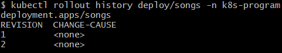

```bash
kubectl rollout undo deploy/songs -n k8s-program
```
📸 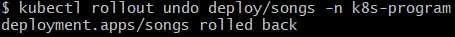

```bash
kubectl rollout status deploy/songs -n k8s-program
```
📸 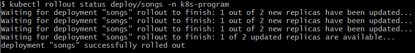

```bash
kubectl rollout history deploy/songs -n k8s-program
```
📸 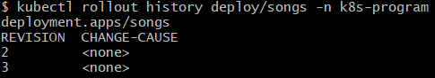

```bash
kubectl get pods -n k8s-program
```
📸 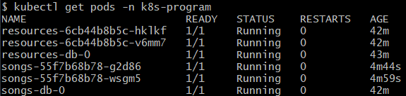

```bash
kubectl describe pod <one-songs-pod> -n k8s-program | grep -i "Image:"
```
📸 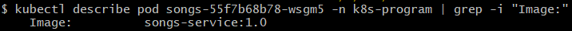

---

✅ **All sub-tasks completed successfully:**
- Sub-task 1 — Secrets & ConfigMaps ✔
- Sub-task 2 — Liveness & Readiness Probes ✔
- Sub-task 3 — RollingUpdate & Genre field ✔
- Sub-task 4 — Deployment History & Rollback ✔
