# Task 03 – Helm Charts & Persistent Storage

This guide documents how Helm was introduced into the Kubernetes setup to automate deployment, configuration, and storage provisioning for the microservices and databases.
It includes creation of Helm charts, templating of configuration, implementing helper templates, and performing upgrades with overridden values.

---

**Source code:** [https://git.epam.com/yevhen_palamarchuk/kubernetes-for-devs/-/tree/main/tasks/03/src](https://git.epam.com/yevhen_palamarchuk/kubernetes-for-devs/-/tree/main/tasks/03/src)

---

## Table of Contents
1. [What to do](#what-to-do)
2. [Sub-task 1: Helm Charts](#sub-task-1-helm-charts)
   - [1.1 Install Helm](#11-install-helm)  
   - [1.2 Create a Helm Chart](#12-create-a-helm-chart)  
   - [1.3 Add Helm Values (namespace & replica-count)](#13-add-helm-values-namespace--replica-count)  
   - [1.4 Create valuesyaml with default values](#14-create-valuesyaml-with-default-values)  
   - [1.5 Deploy using default values](#15-deploy-using-default-values)  
   - [1.6 Deploy using non-default values](#16-deploy-using-non-default-values)  
3. [Sub-task 2: Helm Chart Helpers](#sub-task-2-helm-chart-helpers)
   - [2.1 Create _helpers.tpl](#21-create-_helperstpl)  
   - [2.2 Define helper templates (current date, version)](#22-define-helper-templates-current-date-version)  
   - [2.3 Create ConfigMap using helper labels](#23-create-configmap-using-helper-labels)  

---

## What to do

In this module you will learn how to:

- Attach **persistent storages** to your applications (your PostgreSQL databases and PVCs are already configured from previous tasks).  
- Use **Helm charts** to deploy your applications with configurable **namespace** and **replica-count**.  
- Use **Helm helpers** to generate dynamic labels (current date, version) and apply them to a ConfigMap.

You will work with a single Helm chart that deploys your existing applications (resources and songs) and demonstrates the required Helm features.

---

## Sub-task 1: Helm Charts

In this sub-task you will:

- Install Helm (if not installed yet).  
- Create a Helm chart for your existing microservices.  
- Make **namespace** and **replica-count** Helm values.  
- Add a **values.yaml** file with default values.  
- Deploy the chart using default and non-default values.

---

### 1.1 Install Helm

#### What to do

Install Helm using the official installation guide:  
https://helm.sh/docs/intro/install/

Make sure the `helm` binary is available in your `PATH` (for example in Git Bash on Windows).

#### Verification steps

Run:

```bash
helm version --short
```

You should see a client version similar to:

```text
v3.x.x
```

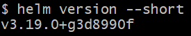

---

### 1.2 Create a Helm Chart

#### What to do

1. Go to your Kubernetes lab folder (for example):

   ```bash
   cd /c/lab/
   ```

2. Create a new chart:

   ```bash
   helm create microservices-intro-helm
   ```

3. Remove default autogenerated templates you do not need and replace them with your own templates for:
   - Namespace
   - `resources` Deployment & Service
   - `songs` Deployment & Service
   - Other objects that you decide to manage with Helm

#### Verification steps

List the chart structure:

```bash
tree microservices-intro-helm -F
```

Verify that:
- The `Chart.yaml` and `values.yaml` files exist.  
- The `templates/` directory contains your custom templates instead of the Helm defaults.

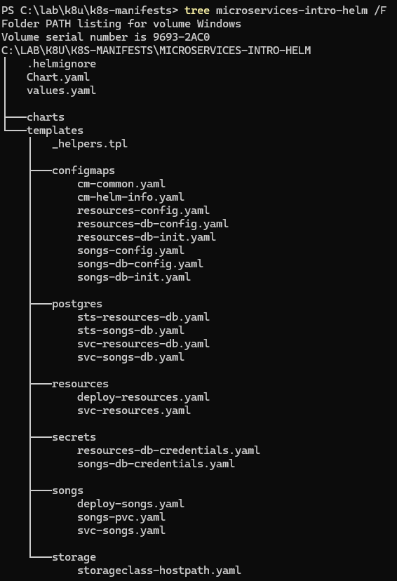

---

### 1.3 Add Helm Values (namespace & replica-count)

#### What to do

In `microservices-intro-helm/values.yaml` add values for namespace and replica counts, for example:

```yaml
global:
  namespace: k8s-program

resourcesService:
  replicaCount: 2

songsService:
  replicaCount: 2
```

Update your Deployment templates to use these values, e.g.:

```yaml
metadata:
  namespace: {{ .Values.global.namespace | quote }}
spec:
  replicas: {{ .Values.resourcesService.replicaCount }}
```

(and similarly for the songs deployment).

#### Verification steps

Render the chart locally and look for the resolved namespace and replicas:

```bash
helm template microservices-intro microservices-intro-helm | grep -A2 "kind: Deployment"
```

Check that the generated YAML contains:
- `namespace: k8s-program`
- `replicas: 2` for both deployments

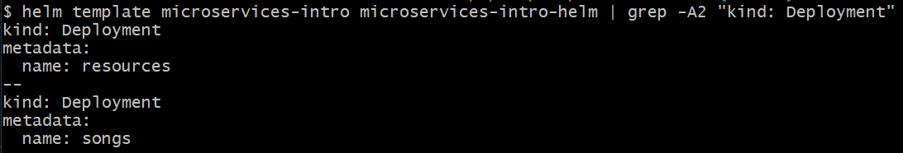

---

### 1.4 Create values.yaml with default values

#### What to do

Extend `values.yaml` to contain default values for images and (optionally) ports:

```yaml
global:
  namespace: k8s-program

resourcesService:
  replicaCount: 2
  image: "resources-service:1.0"
  nodePort: 30080

songsService:
  replicaCount: 2
  image: "songs-service:1.1"
  nodePort: 30081
```

Update the Deployment and Service templates to use these values.

#### Verification steps

Render the chart and inspect one of the deployments and services:

```bash
helm template microservices-intro microservices-intro-helm | grep -A5 "name: resources"
```

Verify that:
- The deployment uses `resources-service:1.0`  
- The service uses the correct port configuration (if you parameterized it).

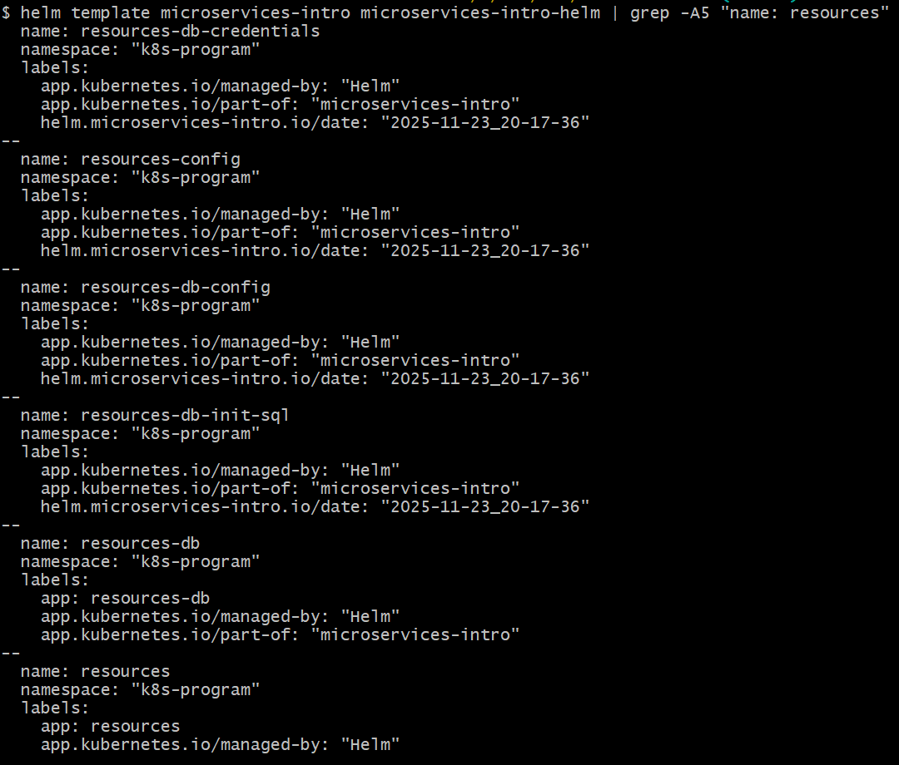
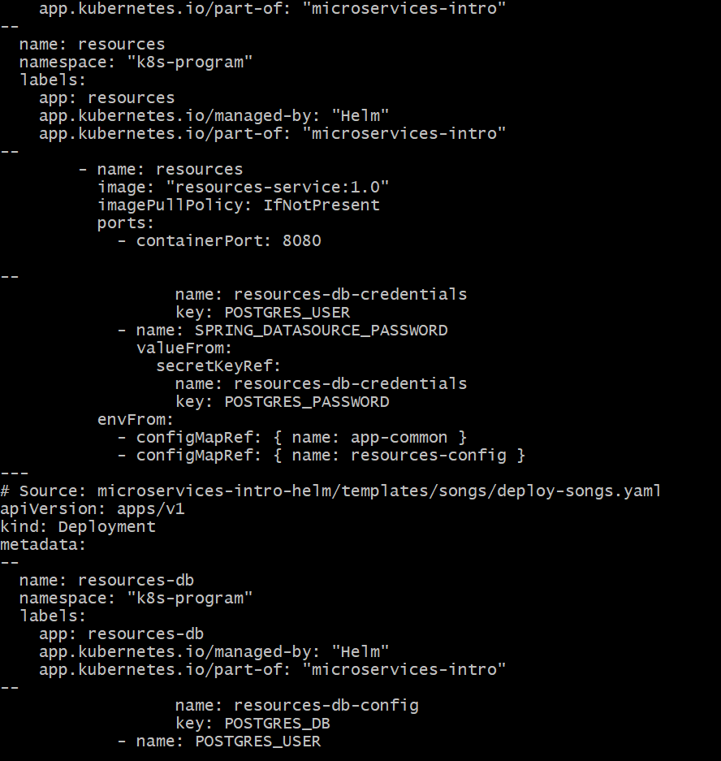
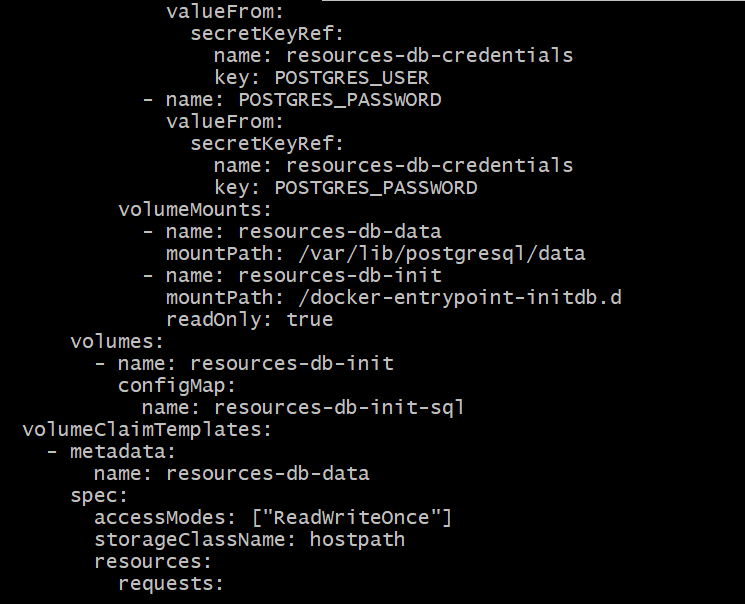
---

### 1.5 Deploy using default values

#### What to do

Install the chart with default values from `values.yaml`:

```bash
helm install microservices-intro microservices-intro-helm   --namespace k8s-program   --create-namespace
```

Wait until all pods are running.

#### Verification steps

```bash
kubectl get pods -n k8s-program
kubectl get deploy -n k8s-program
kubectl get svc -n k8s-program
```

Verify that:
- Deployments for `resources` and `songs` exist.  
- Replica counts match default values (e.g., 2).  
- Services for both applications exist.

Check PVCs from previous tasks:

```bash
kubectl get pvc -n k8s-program
```

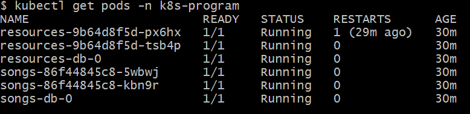
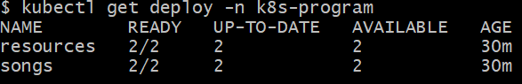
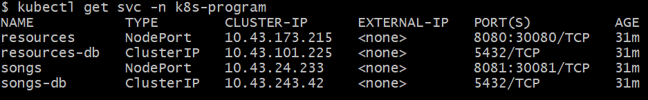
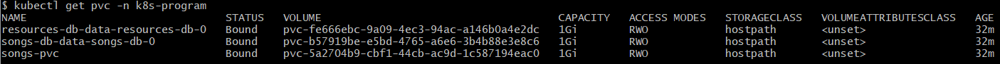

---

### 1.6 Deploy using non-default values

#### What to do

Deploy the chart again with changed namespace and replica counts. Use `helm upgrade` and `--set` to override defaults, for example:

```bash
helm upgrade microservices-intro microservices-intro-helm \
  --namespace k8s-program \
  --set resourcesService.replicaCount=3 \
  --set songsService.replicaCount=3

```

#### Verification steps

```bash
kubectl get deploy -n k8s-program
kubectl get pods -n k8s-program
```

Verify that:
- Both deployments run with `replicas: 3`.  
- Pods are in `Running` state.

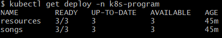
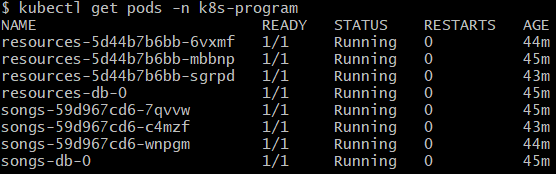

---

## Sub-task 2: Helm Chart Helpers

In this sub-task you will:

- Create a `_helpers.tpl` file.  
- Define helper templates for **current date** and **version**.  
- Use those helpers as labels in a ConfigMap.

---

### 2.1 Create _helpers.tpl

#### What to do

Inside your Helm chart, create file:

```text
microservices-intro-helm/templates/_helpers.tpl
```

You will store your helper templates there.

#### Verification steps

List the templates directory:

```bash
ls microservices-intro-helm/templates
```

Verify that `_helpers.tpl` is present.

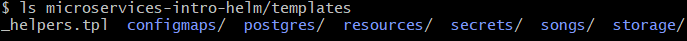

---

### 2.2 Define helper templates (current date, version)

#### What to do

In `_helpers.tpl`, define the following helpers:

```yaml
{{- define "microservices-intro-helm.currentDate" -}}
  {{ now | date "2006-01-02T15:04:05Z07:00" }}
  {{- end }}

  {{- define "microservices-intro-helm.version" -}}
  {{ .Chart.AppVersion }}
  {{- end }}

  {{- define "microservices-intro-helm.commonLabels" -}}
helm.microservices-intro/date: "{{ include "microservices-intro-helm.currentDate" . }}"
helm.microservices-intro/version: "{{ include "microservices-intro-helm.version" . }}"
  {{- end }}

```

Set `appVersion` in `Chart.yaml`, for example:

```yaml
appVersion: "1.0.0"
```

#### Verification steps

Render only the ConfigMap (once you create it in 2.3) or whole chart and search for labels:

```bash
helm template microservices-intro microservices-intro-helm | grep -A3 "helm.microservices-intro"
```

You should see:
- A generated timestamp from `now`  
- The app version from `Chart.yaml`

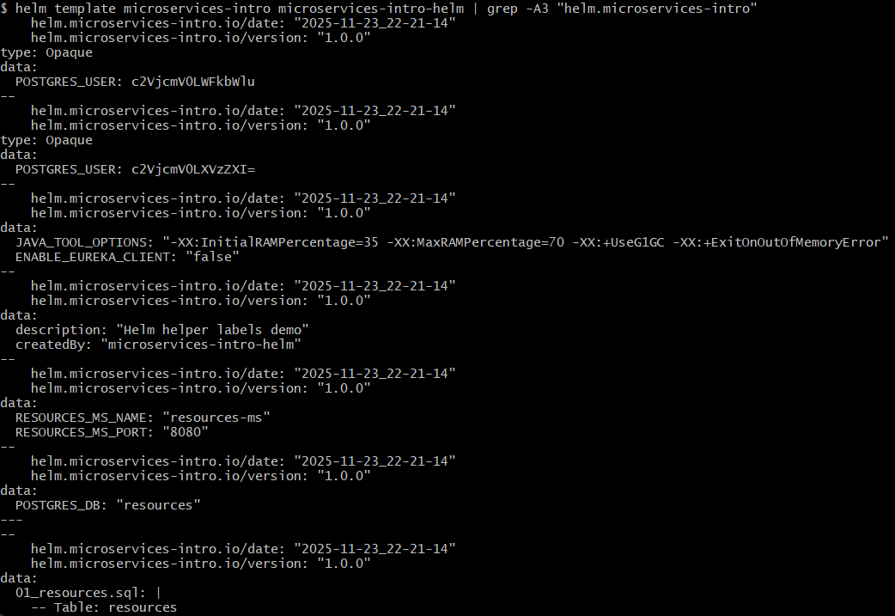

---

### 2.3 Create ConfigMap using helper labels

#### What to do

Create a ConfigMap template, for example `templates/cm-helm-info.yaml`:

```yaml
apiVersion: v1
kind: ConfigMap
metadata:
  name: helm-info
  namespace: {{ .Values.global.namespace | quote }}
  labels:
    {{- include "microservices-intro-helm.commonLabels" . | nindent 4 }}
data:
  description: "Helm helper labels demo"
  createdBy: "microservices-intro-helm"
```

Upgrade the release so that the ConfigMap is applied:

```bash
helm upgrade microservices-intro microservices-intro-helm   --namespace k8s-program
```

#### Verification steps

Describe the ConfigMap in the target namespace, for example:

```bash
kubectl describe configmap helm-info -n k8s-program
```

Verify that:
- The labels include a date value.  
- The labels include the version from `Chart.yaml`.

Example expected lines:

```text
Labels:
  helm.microservices-intro/date: 2025-01-14T14:59:22Z
  helm.microservices-intro/version: 1.0.0
```

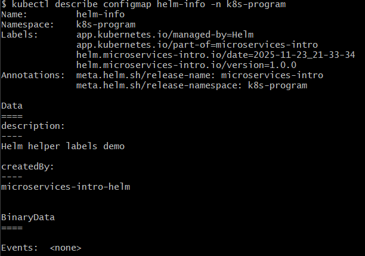

---
